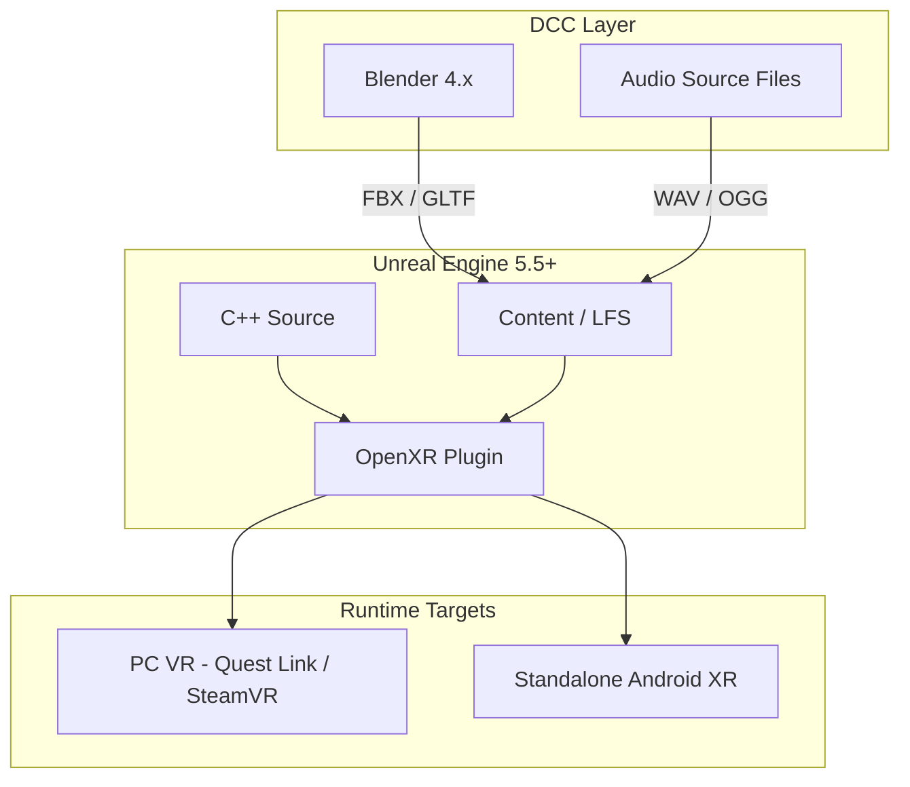

# VRLab26 — Repository Architecture

High-level layout for the VR game monorepo.
> **Detailed guide:** [ARCHITECTURE_README.md](./ARCHITECTURE_README.md) explains where to put each type of file, with examples and rationale.

```
vrlab26-hackathon/
│
├── VRLab26.uproject          # Unreal project entry point
├── Config/                   # Engine & VR runtime settings (OpenXR)
├── Source/VRLab26/           # C++ gameplay code
│   ├── Public/VR/            # VR character, player controller
│   └── Private/VR/
│
├── Content/VRLab26/          # Unreal assets (Git LFS)
├── Art/Blender/              # Source art & DCC exports (Git LFS)
├── Audio/Source/             # Raw audio before import to UE
│
├── Docs/                     # Design & pipeline documentation
├── Scripts/                  # Dev environment setup & validation
├── Tools/                    # Custom editor utilities & CI helpers
└── .github/                  # Workflows, issue & PR templates
```

## System layers



## Code organization (C++)

| Module / folder | Responsibility |
|-----------------|----------------|
| `VRLab26GameMode` | Default pawn & controller assignment |
| `VR/VRLab26VRCharacter` | HMD camera, motion controllers |
| `VR/VRLab26VRPlayerController` | HMD enable, input routing |
| `Content/.../Blueprints/` | Designer-facing gameplay (future) |

Extend with additional folders as the game grows:

- `Source/VRLab26/Public/Interaction/` — grab, teleport, UI ray
- `Source/VRLab26/Public/Gameplay/` — objectives, scoring
- `Source/VRLab26/Public/Network/` — multiplayer replication

## Branch strategy

| Branch | Purpose |
|--------|---------|
| `main` | Stable, playable builds |
| `develop` | Integration branch for features |
| `feature/<name>` | Individual gameplay or art tasks |
| `art/<asset>` | Large art drops (LFS-heavy) |

## What stays out of Git

Per `.gitignore`: `Binaries/`, `Intermediate/`, `DerivedDataCache/`, `Saved/`, local IDE caches, and build artifacts. Only source, config, and LFS-tracked assets are versioned.
