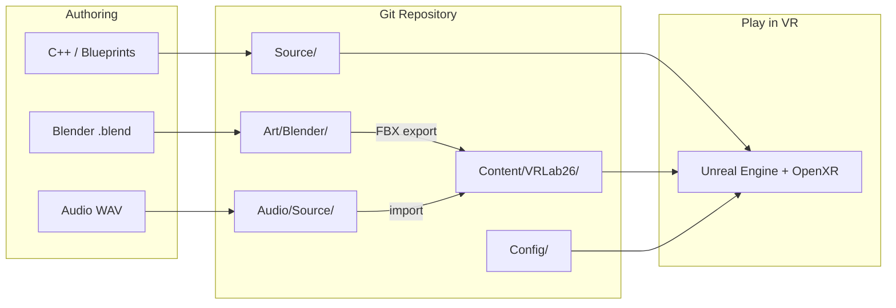

# Architecture README — Where to Put What (and Why)

This document is the **onboarding map** for the VRLab26 repository. It explains how the project is organized, which folder to use for each kind of work, and the reasoning behind those choices.

If you only read one doc besides [SETUP.md](./SETUP.md), read this one.

---

## Design goals

The repo is a **monorepo**: one Git project holds code, engine config, Unreal assets, and Blender source art. That keeps the hackathon team aligned without juggling multiple repositories.

Three principles drive the layout:

1. **Separate source from runtime** — Blender files and raw WAVs live outside `Content/` so artists can iterate without polluting the game folder Unreal loads at runtime.
2. **Text in Git, binaries in LFS** — C++, config, and Markdown are normal Git files. Meshes, textures, `.uasset`, and `.blend` go through **Git LFS** so clones stay fast.
3. **VR-first structure** — OpenXR settings, VR C++ classes, and a dedicated `Content/VRLab26/VR/` folder exist from day one so VR features do not get bolted on later.

---

## Repository map (top level)

```
vrlab26-hackathon/
│
├── VRLab26.uproject          ← Double-click to open the game in Unreal
├── Config/                   ← Engine settings (VR, OpenXR, maps, input)
├── Source/VRLab26/           ← C++ gameplay & VR systems
│
├── Content/VRLab26/          ← Everything Unreal loads in-game (LFS)
├── Art/Blender/              ← Authoritative 3D source files (LFS)
├── Audio/Source/             ← Raw audio before Unreal import (LFS)
│
├── Docs/                     ← Human-readable guides (you are here)
├── Scripts/                  ← Setup & validation scripts (not shipped)
├── Tools/                    ← Future automation (export scripts, editor tools)
└── .github/                  ← CI workflows & PR/issue templates
```

### Quick reference — “I want to add…”

| I want to add… | Put it here | Why |
|----------------|-------------|-----|
| A new C++ VR interaction class | `Source/VRLab26/Public/Interaction/` | Code belongs in `Source/`; Unreal compiles it into the game module |
| A Blueprint-only gameplay actor | `Content/VRLab26/Blueprints/` | Designer-friendly; no compile step; still versioned via LFS |
| A playable level | `Content/VRLab26/Maps/` (or `Maps/Dev/` for tests) | Maps are Unreal assets; `Dev/` keeps experiments out of shipping builds |
| A Blender model (work in progress) | `Art/Blender/<Category>/` | Keeps editable `.blend` separate from imported FBX |
| An FBX export ready for Unreal | `Art/Blender/Exports/` then import → `Content/` | Staging area for DCC output; imported `.uasset` lives in `Content/` |
| A raw voice line or music track | `Audio/Source/` → import → `Content/VRLab26/Audio/` | Source WAV/FLAC archived in repo; compressed cues live in Unreal |
| OpenXR / VR tuning | `Config/DefaultEngine.ini` | Project-wide runtime settings; shared by whole team |
| Default game mode / pawn | Already in `Source/` (`VRLab26GameMode`, `VRLab26VRCharacter`) | C++ base classes; extend or subclass in Blueprints under `Content/` |
| Setup instructions | `Docs/` | Markdown is small, diff-friendly, and readable on GitHub |
| A one-off export script | `Tools/` | Not part of the shipped game; keeps `Scripts/` for dev env only |
| Build output / cache | **Nowhere — do not commit** | Generated locally; listed in `.gitignore` |

---

## Layer 1 — Code (`Source/`)

**Purpose:** Performance-critical logic, VR plumbing, and systems that are awkward in Blueprints alone.

```
Source/
├── VRLab26.Target.cs              # Game build target
├── VRLab26Editor.Target.cs        # Editor build target
└── VRLab26/
    ├── VRLab26.Build.cs           # Module dependencies (OpenXR, Enhanced Input, …)
    ├── Public/                    # Headers other modules / Blueprints can see
    │   ├── VRLab26GameMode.h
    │   └── VR/
    │       ├── VRLab26VRCharacter.h
    │       └── VRLab26VRPlayerController.h
    └── Private/                   # Implementation (.cpp)
        ├── VRLab26.cpp
        ├── VRLab26GameMode.cpp
        └── VR/
            ├── VRLab26VRCharacter.cpp
            └── VRLab26VRPlayerController.cpp
```

### Where to put new C++ code

| System type | Suggested folder | Example |
|-------------|------------------|---------|
| VR locomotion, hands, HMD | `Public/VR/` | Teleport component, hand pose resolver |
| Grab, use, physics interact | `Public/Interaction/` | `UGrabComponent`, interactable interface |
| Objectives, scoring, game rules | `Public/Gameplay/` | `AGameState`, collectible manager |
| Multiplayer / replication | `Public/Network/` | RPCs, replicated variables |
| UI presented in VR | `Public/UI/` | Widget component wrappers |

**Why Public vs Private?** Unreal convention: headers in `Public/` are the module API; `.cpp` files in `Private/` hide implementation details. Blueprints can subclass types declared in `Public/`.

**Rule of thumb:** If it must run every frame in VR or touch OpenXR APIs → prefer C++. If designers need to tweak values often → expose a C++ base class and create a Blueprint child in `Content/VRLab26/Blueprints/`.

---

## Layer 2 — Unreal assets (`Content/VRLab26/`)

**Purpose:** Everything the engine loads when you press Play — maps, meshes, materials, sounds, Blueprints.

```
Content/VRLab26/
├── Animations/       # Sequences, blend spaces, montages
├── Audio/            # Sound cues, meta sounds, attenuation
├── Blueprints/       # Gameplay actors, components, game mode BP variants
├── Characters/       # Skeletal meshes, anim BPs, character materials
├── FX/               # Niagara particles, FX materials
├── Maps/             # Shipping levels
│   └── Dev/          # Sandboxes — safe to break
├── Materials/        # Master materials (M_) and instances (MI_)
├── Meshes/           # Static meshes (SM_) imported from Blender
├── UI/               # UMG widgets, VR menus
└── VR/               # Teleport arcs, hand meshes, OpenXR-specific BP
```

### Why these subfolders?

| Folder | Rationale |
|--------|-----------|
| `Blueprints/` | Central place for designers; avoids hunting through map folders |
| `Maps/` vs `Maps/Dev/` | Prevents accidental shipping of half-baked test levels |
| `VR/` | VR-specific assets (teleport marker, hand SK) stay grouped; easier to audit for comfort/perf |
| `Materials/` vs `Meshes/` | Materials are reused across many meshes; splitting reduces duplication |
| `Characters/` | Player/NPC assets are complex (mesh + anim BP + MI); deserve their own tree |

### Naming (required)

Consistent prefixes make searching and referencing assets predictable:

| Asset | Prefix | Example |
|-------|--------|---------|
| Blueprint | `BP_` | `BP_VR_GrabbableCube` |
| Static mesh | `SM_` | `SM_Prop_Crate_A` |
| Skeletal mesh | `SK_` | `SK_Hands_Male` |
| Material / instance | `M_` / `MI_` | `M_Glass`, `MI_Glass_Dirty` |
| Texture | `T_` | `T_Crate_BaseColor` |
| Map | descriptive | `MainMenu`, `Level_01_Arena` |

More detail: [Content/VRLab26/README.md](../Content/VRLab26/README.md).

---

## Layer 3 — Art source (`Art/Blender/`)

**Purpose:** Store **editable** 3D work. Unreal should consume **exports**, not `.blend` files directly.

```
Art/Blender/
├── Characters/       # Rigged models, hands, NPCs
├── Environments/     # Modular kits, terrain pieces, skyboxes
├── Props/            # Interactive and decorative objects
├── Materials/        # Shared node groups, material libraries
└── Exports/          # FBX/GLB staged for import into Unreal
```

### Workflow

```
Blender (.blend)  →  export FBX  →  Art/Blender/Exports/  →  import  →  Content/VRLab26/
     ↑ commit LFS         ↑ commit LFS                              ↑ .uasset in LFS
```

**Why not put `.blend` files in `Content/`?** Unreal cannot use them at runtime. Keeping Blender sources in `Art/` makes it obvious what is “source” vs “game-ready.”

**Why `Exports/`?** Reviewers can see exactly what was imported into Unreal. Re-imports stay reproducible.

Full export settings: [BLENDER_PIPELINE.md](./BLENDER_PIPELINE.md).

---

## Layer 4 — Audio (`Audio/Source/`)

**Purpose:** Archive lossless source files; Unreal uses compressed assets in `Content/VRLab26/Audio/`.

| Stage | Location | Format |
|-------|----------|--------|
| Raw recording / export | `Audio/Source/` | WAV, FLAC |
| In-engine cue | `Content/VRLab26/Audio/` | `.uasset` sound cue / meta sound |

**Why two locations?** Source files are large but irreplaceable; Unreal imports optimize for runtime (compression, streaming). You can re-import if compression settings change.

---

## Layer 5 — Configuration (`Config/`)

**Purpose:** Project-wide engine behavior — not per-asset, not code.

| File | What it controls |
|------|------------------|
| `DefaultEngine.ini` | Maps, rendering, **OpenXR / HMD**, Android packaging |
| `DefaultGame.ini` | Project name, version, **bStartInVR**, packaging rules |
| `DefaultInput.ini` | Enhanced Input defaults, axis settings |
| `DefaultEditor.ini` | VR Preview in editor, PIE behavior |

**When to edit:** Changing default map, enabling hand tracking, tuning stereo rendering, or setting Android package name. **Do not** put one-off level settings here if they belong on the level itself.

---

## Layer 6 — Supporting folders (not shipped)

| Folder | Contents | Why separate |
|--------|----------|--------------|
| `Docs/` | Setup, architecture, VR design | Readable on GitHub without opening Unreal |
| `Scripts/` | `setup-dev.ps1`, `validate-project.sh` | Environment setup; not part of game package |
| `Tools/` | Future Blender batch export, editor utilities | Grows over time; keeps root clean |
| `.github/` | CI, PR templates | GitHub-specific automation |

---

## What never goes in Git

These are generated on each machine and listed in `.gitignore`:

| Path | Reason |
|------|--------|
| `Binaries/` | Compiled game DLLs — rebuilt from `Source/` |
| `Intermediate/` | Compiler temp files |
| `DerivedDataCache/` | Cached derived data — huge, machine-specific |
| `Saved/` | Autosaves, local logs, config overrides |
| `*.sln` / IDE caches | Regenerated by setup scripts |

Committing these causes merge pain and bloated clones.

---

## Data flow (how work moves through the repo)



---

## Common scenarios (step by step)

### Scenario A — “I’m adding a grabbable prop”

1. Model in Blender → save to `Art/Blender/Props/Prop_Mug.blend`
2. Export FBX → `Art/Blender/Exports/Props/SM_Prop_Mug.fbx`
3. Import FBX in Unreal → `Content/VRLab26/Meshes/Props/SM_Prop_Mug`
4. Create Blueprint `Content/VRLab26/Blueprints/BP_Prop_Mug` (physics, grab interface)
5. Place in map under `Content/VRLab26/Maps/Dev/` for testing
6. Commit; verify `git lfs status` before push

### Scenario B — “I’m adding teleport locomotion”

1. C++ component in `Source/VRLab26/Public/VR/` (arc trace, validation)
2. Optional Blueprint child in `Content/VRLab26/VR/` for VFX/material tweaks
3. Input mapping in Enhanced Input assets under `Content/VRLab26/VR/`
4. Test with VR Preview; document comfort options in [VR_DESIGN.md](./VR_DESIGN.md)

### Scenario C — “I’m only writing design docs”

1. Add or edit Markdown in `Docs/`
2. Link from this file or [README.md](../README.md) if it’s a major topic
3. No LFS needed

---

## Branching & ownership (who touches what)

| Branch pattern | Typical changes |
|----------------|-----------------|
| `feature/gameplay-*` | `Source/`, `Content/VRLab26/Blueprints/` |
| `art/*` | `Art/Blender/`, large LFS drops into `Content/` |
| `docs/*` | `Docs/` only |
| `main` | Stable, playable — merge via PR |

Artists can work mostly in `Art/` and `Content/`; programmers in `Source/` and `Config/`; everyone reads `Docs/`.

---

## Related documentation

| Document | Focus |
|----------|-------|
| [ARCHITECTURE.md](./ARCHITECTURE.md) | Short system diagram & branch strategy |
| [SETUP.md](./SETUP.md) | Install Unreal, Blender, Git LFS, first run |
| [BLENDER_PIPELINE.md](./BLENDER_PIPELINE.md) | Export settings Blender → Unreal |
| [VR_DESIGN.md](./VR_DESIGN.md) | Comfort, performance budgets, playtesting |
| [CONTRIBUTING.md](../CONTRIBUTING.md) | PR checklist, LFS rules |

---

## Summary cheat sheet

```
C++ code              → Source/VRLab26/
Engine settings       → Config/
In-game assets        → Content/VRLab26/<category>/
Blender work          → Art/Blender/<category>/
FBX before import     → Art/Blender/Exports/
Raw audio             → Audio/Source/  →  import  →  Content/VRLab26/Audio/
Documentation         → Docs/
Dev machine setup     → Scripts/
Build/cache junk      → DO NOT COMMIT (see .gitignore)
```

When in doubt: **source files live outside `Content/`; game-ready assets live inside `Content/VRLab26/`.**
